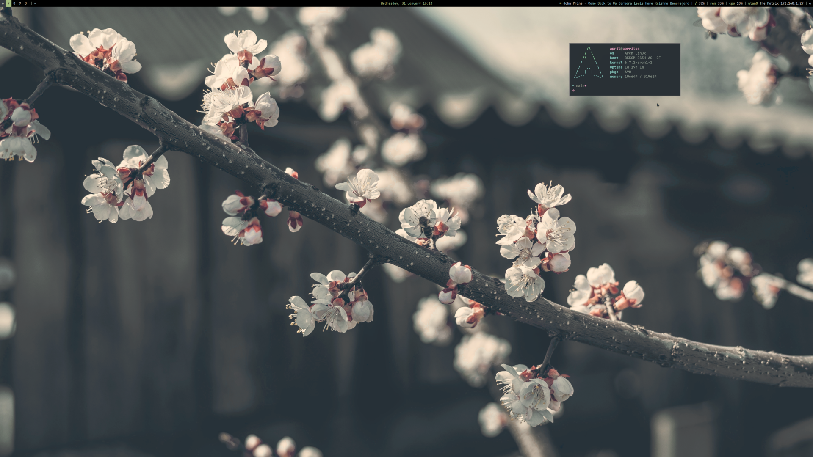
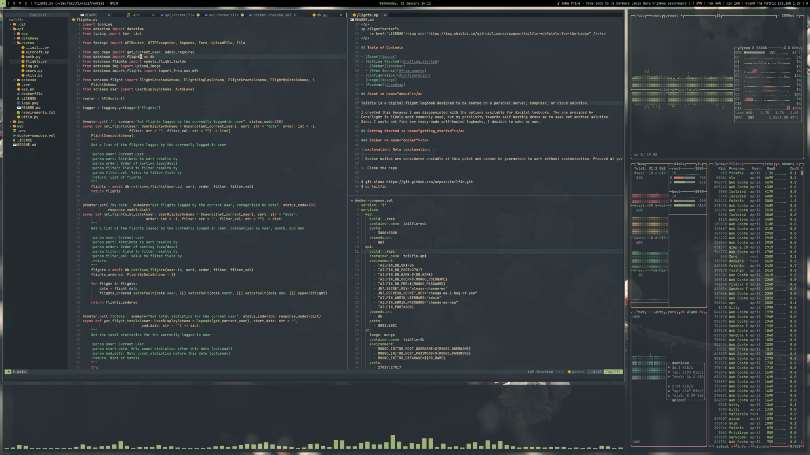

# dotfiles

here are the dotfiles and some of the programs i use for my bspwm setup. wip.

  
<b>📸 screenshots</b>

  
  

## programs
### 🏗️ system
- distro: [arch linux](https://archlinux.org)
- wm: [bspwm](https://github.com/baskerville/bspwm) ([cheat sheet](https://gist.github.com/amit08255/43ed6efdc1952d88f9a61e86f375e924))
- dm: [lightdm](https://github.com/canonical/lightdm) with [mini-greeter](https://github.com/prikhi/lightdm-mini-greeter)
- compositor: [picom](https://github.com/yshui/picom)
- aur helper: [paru](https://github.com/Morganamilo/paru)
- file manager: [nnn](https://github.com/jarun/nnn) and [thunar](https://wiki.archlinux.org/title/Thunar)
- launcher: [rofi](https://github.com/davatorium/rofi)
- bar: [polybar](https://github.com/polybar/polybar)
- notifications: [dunst](https://github.com/dunst-project/dunst)
- fonts: [jetbrains mono](https://github.com/JetBrains/JetBrainsMono)
- theme: [everforest](https://github.com/sainnhe/everforest)
  - [gtk](https://github.com/Fausto-Korpsvart/Everforest-GTK-Theme)
  - [icons](https://github.com/yeyushengfan258/Reversal-icon-theme)
  - [rofi](https://github.com/newmanls/rofi-themes-collection)
  - [neovim](https://github.com/neanias/everforest-nvim)
  - [firefox](https://addons.mozilla.org/en-US/firefox/addon/everforest-dark-official/)
  - [duckduckgo](https://github.com/temefleet/everforest-theme-duckduckgo)
  - [cursors](https://github.com/talwat/everforest-cursors)

### ⌨️  terminal
- shell: bash
- emulator: [kitty](https://sw.kovidgoyal.net/kitty/) - (previously used [wezterm](https://wezfurlong.org/wezterm/index.html) but it gave me trouble with prompt configuration)
- prompt: [starship](https://starship.rs)
- fetch: [pfetch](https://github.com/dylanaraps/pfetch)
- monitor: [bottom](https://github.com/ClementTsang/bottom) and/or [btop](https://github.com/aristocratos/btop)
- [fzf](https://github.com/junegunn/fzf) - multi-purpose finder
- [glow](https://github.com/charmbracelet/glow) - markdown preview

### 🚀 development
- ide: [lunarvim](https://www.lunarvim.org/)

### 🌌 media
- music: [feishin](https://github.com/jeffvli/feishin)

### 🪐 misc
- [redshift](http://jonls.dk/redshift/) - saves my eyes at night
- [taskline](https://github.com/perryrh0dan/taskline) - todo list
- [kabmat](https://github.com/PlankCipher/kabmat) - kanban boards
- [alternatives](https://github.com/mayfrost/guides/blob/master/ALTERNATIVES.md) - not a program, but a list of better programs
- [maim](https://github.com/naelstrof/maim) - screenshots
- [dua](https://github.com/Byron/dua-cli) - disk usage analyzer
- [copyq](https://github.com/hluk/CopyQ) - clipboard manager

### 🎉 fun
- [cava](https://github.com/karlstav/cava) - music visualizer
- [pipes.sh](https://github.com/pipeseroni/pipes.sh) - pipes screensaver
- [cmatrix](https://github.com/abishekvashok/cmatrix) - matrix-like screensaver
- [cbonsai](https://gitlab.com/jallbrit/cbonsai) - generate bonsai trees
